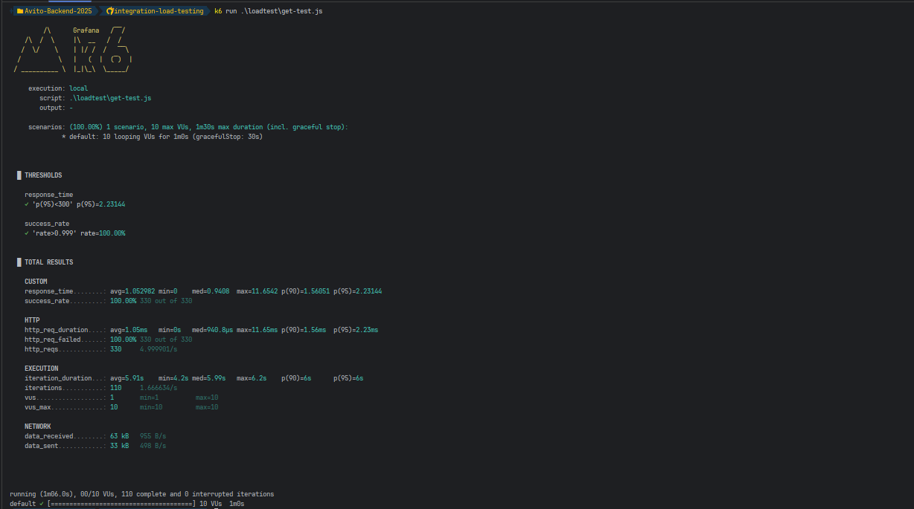

# **Тестовое задание для стажёра Backend (осенняя волна 2025)**

## **Сервис назначения ревьюеров для Pull Request’ов**

Внутри команды требуется единый микросервис, который автоматически назначает ревьюеров на Pull Request’ы (PR), \
а также позволяет управлять командами и участниками. Взаимодействие происходит исключительно через HTTP API.

## Вопросы и Проблемы возникшие в ходе выполнения задания
1. Разделение логики эндпоинтов
   1. Эндпоинт для создание и обновления команды был разделен на два отдельных эндпоинта: 
   один для создания команды, другой для обновления информации о команде. Данное изменение выполнено
   для соответствия RESTful принципам и улучшения читаемости кода.
2. Изменение статусов ответов
   1. Статусы ответов были изменены для более точного отражения результатов операций. Например, 
   при возниконовении конфилкта при создании ресурса возвращается статус 409 Conflict вместо 400 Bad Request.

## **Запуск сервиса**
1. Выполнить клонирование репозитория:
```bash
git clone https://github.com/mr1cloud/Avito-Reviewer
cd Avito-Reviewer
```
2. Создать копию файла `example.env` с именем `.env`.
3. Открыть терминал и выполнить команду для запуска сервисов:
```bash
make up
```
4. Сервис будет доступен по адресу: `http://localhost:8080`
5. Для остановки сервисов выполните команду:
```bash
make down
```

## **Проведение нагрузочного тестирования**
Для проведения нагрузочного тестирования сервиса был использован инструмент `k6`.
Важно: если вы захотите провести нагрузочное тестирование, убедитесь, что k6 установлен на вашем компьютере.
Запуск теста можно выполнить следующей командой:
```bash
make k6-get-test
```

## **Результат тестирования во время разработки:**


## **Документация по API**
В сервисе доступна документация по API, которая автоматически генерируется с помощью Swagger.
После запуска сервиса, документация будет доступна по следующему адресу: `http://localhost:8080/docs`

## **Дополнительная информация**
- Во время реализации проекта использовался паттерн проектирования Repository для управления доступом к данным.
- Для хранения данных используется PostgreSQL.
- В проекте реализована обработка ошибок и логирование с использованием библиотеки Logrus.
- В проекте используются миграции для управления схемой базы данных на основе библиотеки Goose.
- Был реализован дополнительный эндпоинт для получения статистики по кол-ву откртытых
и закрытых PR (`GET /pullRequest/stats`, если указать параметр team_name, то вернуться данные для указанной команды).

## **Доступные команды в make**
- `make migrate-up` - Применение всех миграций к базе данных.
- `make migrate-down` - Откат всех миграций в базе данных.
- `make goose ARGS=""` - Выполнение команды goose с указанными аргументами.
- `make run` - Запуск сервиса без использования Docker.
- `make gen-docs` - Генерация документации Open API v3.
- `make up` - Запуск сервиса и базы данных в Docker контейнерах.
- `make down` - Остановка и удаление Docker контейнеров.
- `make golangci-lint` - Запуск статического анализа кода с помощью golangci-lint.
- `make k6-get-test` - Запуск нагрузочного `get` тестирования с помощью k6.